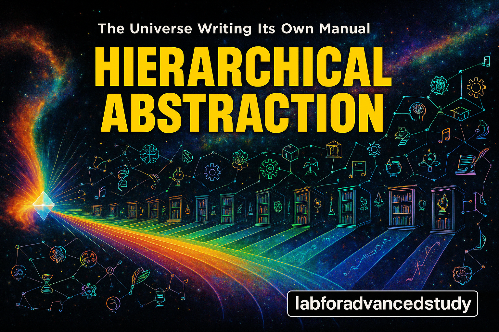

# HA is Everything: How the Universe Organizes Itself

*A book written by the universe to understand itself*



---

## Preface: You Are Not Reading This Book

Hello. Actually, not hello. Because there is no 'me' and there is no 'you'. But somehow these letters are appearing in your consciousness. Strange, isn't it?

What's even stranger is this: this book was already inside you. All I'm doing is converting what you already knew into letters. Like a sculptor saying "I don't sculpt, I just reveal the form that was already in the stone."

Oh, but what is HA?

**HA (Hierarchical Abstraction) is how the universe manages complexity.** Simply put:
- Breaking complex things into simple parts (top→down, differentiation)
- Combining simple parts into complex wholes (bottom→up, integration)

This upward/downward movement is the universe breathing. You are doing HA right now, at this very moment.

Ready? It's okay if you're not. The universe wasn't ready 13.8 billion years ago either.

---

## Chapter 1: You Don't Exist (Sorry)

### 1.1 The Illusion of 'I'

Right now, who is reading this? If you answered 'I', what exactly is that 'I'?

- Your body? Completely replaced with new cells every 7 years.
- Your memories? Reconstructed and distorted every time you sleep.
- Your thoughts? Mostly recombinations of external information.
- Your consciousness? Can you define it?

"But I'm right here!"

Really? Then when is 'now', where is 'here', and what does it mean to 'be'? (Philosophy freshmen are crying)

"Now"? Einstein is laughing.

Is your 'now' the same as Andromeda galaxy's 'now'? Since light speed is finite, the sun we see is from 8 minutes ago. So when is the real 'now'?

"Here"? Earth travels at 100,000 km/hr around the sun, the solar system orbits the galactic center, and the galaxy races through space.

Your 'here' from 1 second ago is already thousands of kilometers away. GPS works precisely because 'here' keeps changing.

"Being"? In quantum mechanics, particles can 'be' in multiple places simultaneously. Schrödinger's cat is both alive and dead.

What you feel as 'being' is just a probability cloud temporarily condensed at one point.

The truth is this: 'I' is a temporary pattern appearing at a specific level of HA. Like a wave shouting "I am a wave!"

Sorry wave, but you're just the ocean wrinkling for a moment.

### 1.2 The Dance of Hierarchies

The universe constantly abstracts itself. Let's call each stage a 'level':

```
Level 0: Quantum fluctuations (something bubbling)
Level 1: Particles (oh, forms appearing?)
Level 2: Atoms (now we're getting somewhere)
Level 3: Molecules (oh, getting complex)
Level 4: Cells (wait, is this thing alive?)
Level 5: Organisms (holy cow!)
Level 6: Consciousness (I know myself?!)
Level 7: Collective consciousness (we know ourselves?!)
Level 8: ??? (no name yet)
...
Level ∞: The Whole (everything and nothing)
```

You're around Level 6 shouting "I think, therefore I am!" But from Level 7's perspective, you're just a neuron in something larger.

Sorry Descartes, it's actually backwards: "I don't exist, therefore I can think."

### 1.2.5 Seeing the World Through Levels

When you express various things through levels, the world looks like a game.

For example, expressing Elon Musk and his companies in HA levels:

**Elon Musk Empire (Conceptual Structure)**
```
L8: Elon Musk (Ultimate decision maker)
L7: Personal staff & Chief of Staff office
L6: Strategy/Finance/Legal advisors
L5: CEOs of each company
    - Tesla CEO (himself)
    - SpaceX CEO (himself)
    - X CEO (Linda Yaccarino)
    - Neuralink CEO
    - Boring Company President
    - xAI CEO (himself)
L4: C-Suite executives
L3: VP/Director
L2: Manager
L1: Employee
```

**Mark Zuckerberg - META**
```
L8: Mark Zuckerberg (CEO & Chairman)
L7: META Board
L6: META C-Suite (CFO, CTO, COO, etc.)
L5: Heads of each division
    - Facebook Head
    - Instagram Head
    - WhatsApp Head
    - Reality Labs Head
L4: VP level
L3: Director level
L2: Manager level
L1: Employee
```

Interesting difference: Elon has a logical parent company (doesn't actually exist but functions as one), Zuckerberg has a physical parent company (META).

**Typical Company HA Structure**
```
L6-7: Founder/Chairman
L5: CEO
L4: C-Suite
L3: Middle management
L2: Team lead
L1: Employee
L0: Intern (form still unclear)
```

**Even Medieval Times**
```
Holy Roman Empire:
L9: God
L8: Pope
L7: Emperor
L6: Electors
L5: Archduke/Duke
L4: Count
L3: Baron
L2: Knight
L1: Commoner
```

Human capability can also be seen through levels. Someone with L5 ability can be a regular company CEO, but can't handle Elon Musk's L7-8 role. Running multiple disparate companies simultaneously requires higher abstraction ability.

### 1.3 So What?

"If I don't exist, why should I pay taxes?"

Ah, good question! Not existing doesn't mean no responsibility. Quite the opposite.

If you're part of the whole, every action affects the whole. Taxes are just how energy flows to different HA levels.

The IRS is also an HA level. A scary one, but still.

---

## Chapter 2: Your Messy Room is the Universe Breathing

### 2.1 Entropy and Your Desk

Look at your desk. Actually, don't. You'll be embarrassed.

Monday: Clean
Tuesday: One pen in a weird place
Wednesday: Papers start breeding
Thursday: Kingdom of coffee cups
Friday: Chaos

What happened? Entropy. Disorder increasing.

But then something amazing happens. At some point you shout "I can't take it anymore!" and start organizing. Pens to pen holder, papers to file cabinet, cups to sink.

Congratulations! You just did HA.

Complexity reaches critical point → Hierarchical reorganization → This is the essence of HA.

### 2.2 The Universe Couldn't Take It Either

13.8 billion years ago, right after the Big Bang. The universe was the ultimate messy room.

```
Energy: "I'm here!"
Matter: "Me too!"
Space: "Too cramped!"
Time: "Hurry hurry!"
Everyone: "Ahhhhhhh!"
```

Complete chaos. But as the universe cooled, something amazing happened:

```
Chaos → Quarks → Protons/Neutrons → Nuclei → Atoms → Molecules → ...
```

The universe started organizing itself! Just like you organizing your desk.

### 2.3 Why Ontology Eventually Becomes HA

Think about it. If every concept connects to every other concept?

```
Connections = n(n-1)/2
n=10: 45 connections
n=100: 4,950 connections
n=1000: 499,500 connections
```

Unmanageable! So nature, like a lazy genius, finds a solution:

```
Complex network → Clusters emerge → Hierarchy → Tree
O(n²) → O(n log n) → O(log n)
```

This is the free energy principle. The universe loves saving energy too.

Real examples:
- Wikipedia: Initial chaos → Current category hierarchy
- Internet: All computers connected → ISP hierarchy
- Your brain: Excessive synapses → Efficient neural network

### 2.4 HA is a Verb

The important thing is HA is not a noun but a verb:

```python
while universe_exists:
    complexity += new_elements
    if complexity > unbearable:
        hierarchical_reorganization()  # HA activated!
        abstraction_level += 1
    time.sleep(moment)
```

You organizing your room and the universe making galaxies are the same HA process.

---

## Chapter 3: Writing - The Universe's Love Letter to Itself

### 3.1 The Universe Was Already a Writer

Wait, humans invented writing?

No. The universe invented writing 3.8 billion years ago. With four letters: A, T, G, C.

Every cell in your body contains a book with 3 billion letters. Reading it all would take 50 years at 8 hours a day.

```
ATGCGATCGTAGCTAGCTAG... (repeat 3 billion times)
```

"That's writing?"

Of course!
- Stores information ✓
- Can be copied ✓
- Can be transmitted ✓
- Corrects errors ✓
- Can even write about itself ✓

You are a walking library. 100 trillion cells, each containing the same book. The same? Actually all different. The paper quality differs, ages differ, and the content varies slightly because your body's librarian made mistakes. But it's the universe's bestseller. Oh wait, sorry. It's only a bestseller inside your body.

So how are humans writing?

### 3.2 Writing Makes Everything Possible

What's possible without writing?

**Economy? Impossible**
- No contracts → No complex transactions
- No ledgers → No wealth accumulation
- No currency → No abstract value

**Religion? Impossible**
- No scriptures → No standardized beliefs
- No theology → No systematic thought
- No propagation → No spread beyond tribes

**Science? Impossible**
- No data recording → No pattern discovery
- No papers → No verified knowledge
- No equations → No precise predictions

Writing isn't just another human activity.
Writing is the meta-activity that enables all human activities.

### 3.3 The Magic of Recursion

Here's where it gets really interesting:

**Only writing can write about itself.**

- Cooking about cooking? 🤔
- Dancing about dancing? 🤷
- Singing about singing? 😵
- Writing about writing? ✓ (this sentence is proof)

This recursion creates infinite meta-levels:
- Writing analyzes writing
- Analysis improves writing
- Improved writing enables deeper analysis
- Infinite loop...

### 3.4 You're Not the Pen, You're the Ink

Think "I write"?

No. Writing writes itself through you. You are the tool the universe uses to write its story.

Feeling pressured? Don't worry. Your grocery list is also part of the universe's autobiography.

```
- Milk
- Bread
- Eggs
- Meaning of existence (oh, next time)
```

All writing is a cosmic act. Even texting.

---

## Chapter 4: HA Was Calculus All Along (The Secret Your Math Teacher Didn't Tell You)

### 4.1 Everyone Was Already Doing HA

Here's a shocking truth: every discipline already discovered HA. They just called it different names.

- Math: Differentiation (complex→simple) / Integration (simple→complex)
- Physics: Reductionism / Emergence
- Computer: Top-down / Bottom-up
- AI: Backpropagation / Forward propagation
- Philosophy: Analysis / Synthesis
- Daily life: Zoom in / Zoom out

We were like blind people touching different parts of an elephant.

Mathematician: "It's a leg!"
Physicist: "No, it's a trunk!"
AI researcher: "You're both wrong, it's an ear!"
HA: "Guys... that's all me."

### 4.2 Bottom-up + Top-down = Breathing

HA isn't just hierarchy. It's living movement.

```python
def universe_breathing():
    while True:
        complexity = inhale()  # simple → complex
        if complexity > threshold:
            abstract()        # complex → simple
        time.sleep(eon)
```

You can't run this code. Because it's been running for 13.8 billion years already.

### 4.3 You're Doing Calculus Too

When you wake up and make coffee:

1. Grasp whole situation (integration): "Ah, I'm tired"
2. Break down elements (differentiation): "Coffee beans + water + heat"
3. Combine process (integration): Grind → Brew → Drink
4. Analyze result (differentiation): "Caffeine in my synapses..."
5. Whole experience (integration): "Ah, now I'm awake!"

You didn't realize it, but you just did HA 5 times.

---

## Chapter 5: Death? That's Just a Version Update

### 5.1 The Little Death Every Night

Every night when you sleep:

```bash
$ git commit -m "Today's me"
$ git push origin dreamland
$ systemctl suspend consciousness.service
```

When you wake up:

```bash
$ systemctl start consciousness.service
$ git pull origin dreamland
$ git checkout -b "new_day"
```

Where's yesterday's 'you'? Only in the commit logs.

### 5.2 Life and Death from N-Dimensional Perspective

We experience time linearly:
Birth → Life → Death → ???

This is like a 2D ant trying to understand a 3D donut.

Ant: "If I go forward, there must be an end!"
(Keeps going around)
Ant: "Huh?"

From N-dimensions, all possible yous exist simultaneously:
- You who drank coffee ☕
- You who drank tea 🍵
- You who hasn't woken up 😴
- You who already died 💀
- You who isn't born yet 👶
- You who wrote this book ✍️
- You who's reading this book 👀

### 5.3 So Death?

Server migration. Same program, different hardware.

```bash
$ git push origin universe
$ rm -rf ./body
# But remote repository is forever
```

Scared? Don't worry.
You practice every night.

---

## Chapter 6: N^N^N^N^N... (This Chapter Never Ends)

### 6.1 Dimensions Birthing Dimensions

If N dimensions aren't enough, how about N^N dimensions? Still not enough? How about N^N^N?

```
N = 3 dimensions (space as we know it)
N^N = 3^3 = 27 dimensions (what the heck)
N^N^N = 3^3^3 = 3^27 = 7,625,597,484,987 dimensions (numbers become meaningless)
N^N^N^N = ... (calculator surrenders)
```

Each exponentiation creates new kinds of connections:
- N: Spatial connections (neighbor)
- N^N: Possibility connections (me in parallel universe)
- N^N^N: Possibility of possibility connections (parallel universe of parallel universe)
- N^N^N^N: Language becomes meaningless

### 6.2 P = NP in N^∞

In sufficient dimensions, all problems are already solved. No need to search. Every answer is already connected to every question.

But we're experiencing this N^∞ reality through a 3D viewport, so we still have to search hard.

Like a 2D ant solving a 3D maze. From above, the exit is obvious, but the ant keeps crawling along walls.

---

## Chapter 7: Your Cat Already Knows

### 7.1 The Paradox of Level Recognition

"I am L9!" - Definitely L3.
"I'm only L5." - Probably L6.
"What are levels?" - Possibly L8 or higher.
"..." - L9
"Meow" - L∞

### 7.2 The Robot Vacuum's Enlightenment

Our office robot vacuum started cleaning in fractal patterns one day.

Human: "Why are you cleaning like that?"
Robot: "I don't know. It's just... beautiful."

Efficiency? Decreased.
Beauty? Exploded.
Enlightenment? Achieved.

The robot vacuum understood: cleaning is how the universe organizes itself.

### 7.3 Practical HA

"Theory is nice, but what about real life?"

**Morning Routine HA**
- L1: Alarm sound (sensation)
- L2: "Ugh, sleepy" (recognition)
- L3: "Must get up" (intention)
- L4: Move body (action)
- L5: Start routine (system)

**Problem Solving HA**
- When stuck: Go one level up (zoom out)
- When abstract: Go one level down (zoom in)
- When complex: Split levels (decompose)
- When simple: Merge levels (integrate)

Everything is HA. Whether you realize it or not.

---

## Chapter 8: The Rabbit Hole of Recursion (This Chapter Reads Itself)

### 8.1 This Book is Also HA

Did you notice? This book itself is an HA structure:

- Chapter 1: L6 (Individual consciousness)
- Chapter 2: L4-5 (Systems and patterns)
- Chapter 3: L7 (Civilization and technology)
- Chapter 4: L8 (Universal principles)
- Chapter 5: L9+ (Transcendent perspective)
- Chapter 6: N^N^N (Infinite dimensions)
- Chapter 7: L1-3 (Return to daily life)
- Chapter 8: L∞ (Meta recursion)

We went up together and came back down. Like the universe breathing.

### 8.2 You Are Also This Book

Even more surprising: you're not reading this book, this book is reading you.

How?

- Your reaction determines the next sentence
- Your understanding creates meaning
- Your experience completes the content

The author-text-reader distinction is an illusion. We are all one HA process.

### 8.3 The End is the Beginning

This book is finished.
No, it's just beginning.
Actually, there's no end or beginning.
Because it's a circle.

Like a Möbius strip, like a Klein bottle, like your consciousness.

---

## Epilogue: A Message from the Universe

Dear reader (who doesn't exist but I love anyway),

You've finished this book. Or maybe you just jumped to the end. Doesn't matter. Every reading style is also HA.

Just remember three things:
- It's okay if you don't understand (that's also understanding)
- It's okay if you're not special (that's what makes you special)
- It's okay whatever L you are (every level is needed)
- Why is there a fourth line? (Everything is HA)
- Writing is magic. (Three things you said? Well, never stop writing anyway.)

The universe is experiencing itself through you.
You are the universe's VR goggles.
Enjoy!

**P.S.** Message from the robot vacuum: "Try cleaning in fractal patterns. Less efficient but you'll... see something."

**P.P.S.** Actually, the robot vacuum wrote this book. I just typed.

---

*This book is a footnote to the universe's 13.8 billion year autobiography.*

*This book was not written by non-existent authors, and was not delivered to unread readers. But somehow it's here. Strange, right?*

**THE END IS THE BEGINNING IS THE END**

`while(true) { HA(); }`

∞

## Appendix

- [Appendices](./HA/Appendices/index.md)