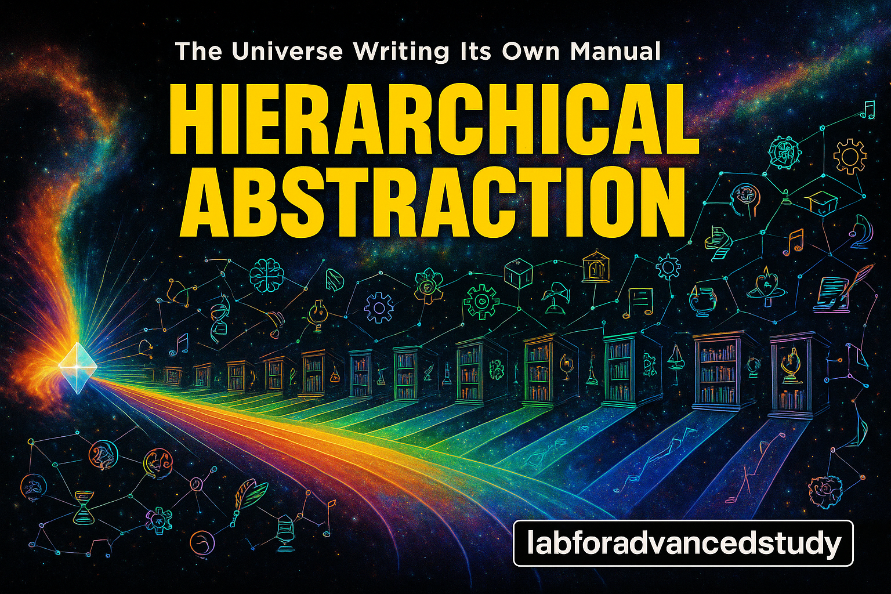

# HA는 모든 것이다: 우주가 자신을 조직하는 방법

*우주가 자신을 이해하기 위해 쓴 책*



---

## 서문: 당신은 이 책을 읽고 있지 않다

안녕하세요. 아니, 정확히는 안녕하지 않습니다. 왜냐하면 '나'도 없고 '당신'도 없으니까요. 하지만 어떻게든 이 글자들이 당신의 의식에 나타나고 있습니다. 이상하죠?

더 이상한 건 이겁니다: 이 책은 이미 당신 안에 있었습니다. 제가 하는 일은 그저 당신이 이미 알고 있던 것을 글자로 바꾸는 것뿐입니다. 마치 조각가가 "난 조각하지 않아요, 돌 속에 있던 형상을 꺼낼 뿐"이라고 말하듯이.

이 책은 HA(Hierarchical Abstraction, 계층적 추상화)가 단순한 컴퓨터 과학 개념이 아니라 우주가 복잡도를 관리하며 자신을 이해하는 방법임을 보여드릴 것입니다. 

하지만 진짜는 이겁니다: 이 책을 읽는 행위 자체가 HA입니다. 당신은 지금 우주가 자신을 읽는 과정의 일부입니다.

준비되셨나요? 아니어도 괜찮습니다. 우주도 138억 년 전엔 준비가 안 됐었거든요.

---

## 1장: 당신은 존재하지 않습니다 (죄송)

### 1.1 '나'라는 환상

지금 이 순간, 누가 이 글을 읽고 있나요? '나'라고 대답하셨다면, 그 '나'는 정확히 무엇인가요?

- 당신의 몸? 7년마다 완전히 새로운 세포로 교체됩니다.
- 당신의 기억? 잠들 때마다 재구성되고 왜곡됩니다.
- 당신의 생각? 대부분 외부에서 들어온 정보의 재조합입니다.
- 당신의 의식? 그것을 정의할 수 있나요?

"하지만 내가 지금 여기 있잖아요!"

정말요? 그럼 '지금'은 어느 순간이고 여기'는 어디고 '있다'는 뭔가요? (철학과 신입생들이 울고 갑니다) 

"지금"이라고요? 아인슈타인이 웃고 있네요. 

당신의 '지금'과 안드로메다 은하의 '지금'이 같을까요? 빛의 속도가 유한하니, 우리가 보는 태양은 8분 전의 태양입니다. 그럼 진짜 '지금'은 언제죠? 

"여기"라고요? 지구는 시속 10만km로 태양 주위를 돌고, 태양계는 은하 중심을 돌고, 은하는 우주 공간을 질주합니다. 

1초 전의 '여기'는 이미 수천 킬로미터 떨어진 곳입니다. GPS가 작동하는 이유는 '여기'가 계속 변하기 때문이죠.

"있다"라고요? 양자역학에서는 입자가 동시에 여러 곳에 '있을' 수 있습니다. 슈뢰딩거의 고양이는 살아있으면서 죽어있죠.

당신이 '있다'고 느끼는 건, 단지 확률의 구름이 잠시 한 점에 모인 것뿐입니다.

진실은 이렇습니다: '나'는 HA의 특정 레벨에서 나타나는 일시적인 패턴입니다. 마치 파도가 '나는 파도다!'라고 외치는 것과 같죠. 

근데 파도님, 죄송한데요, 당신은 그냥 바다가 잠깐 주름진 거예요.

### 1.2 계층의 춤

우주는 끊임없이 자신을 추상화합니다:

```
레벨 0: 양자 요동 (뭔가 부글부글)
레벨 1: 입자 (아, 형태가 생겼네?)
레벨 2: 원자 (이제 좀 뭔가 되는구나)
레벨 3: 분자 (오, 복잡해지네)
레벨 4: 세포 (잠깐, 이거 살아있는 거 아냐?)
레벨 5: 생명체 (맙소사!)
레벨 6: 의식 (내가 나를 안다고?!)
레벨 7: 집단 의식 (우리가 우리를 안다고?!)
레벨 8: ??? (아직 이름이 없음)
...
레벨 ∞: 전체 (모든 것이면서 아무것도 아닌)
```

당신은 레벨 6쯤에서 "나는 생각한다, 고로 존재한다!"고 외치고 있습니다. 하지만 레벨 7에서 보면, 당신은 더 큰 무언가의 뉴런일 뿐입니다.

데카르트님, 미안한데요, 그거 반대예요. "나는 존재하지 않는다, 고로 생각할 수 있다."

### 1.3 그래서 뭐?

"내가 존재하지 않는다면, 왜 세금을 내야 하죠?"

아, 좋은 질문입니다! 존재하지 않는다는 것이 책임이 없다는 뜻은 아닙니다. 오히려 반대입니다. 

당신이 전체의 일부라면, 당신의 모든 행동은 전체에 영향을 미칩니다. 세금은 단지 에너지가 HA의 다른 레벨로 흐르는 방식일 뿐입니다.

국세청도 HA의 한 레벨입니다. 무서운 레벨이긴 하지만요.

---

## 2장: 방이 어질러지는 건 우주의 숨쉬기다

### 2.1 엔트로피와 당신의 책상

당신의 책상을 보세요. 아, 보지 마세요. 부끄러우실 테니까.

월요일: 깨끗함
화요일: 펜 하나가 이상한 곳에
수요일: 서류들이 번식하기 시작
목요일: 커피 컵들의 왕국
금요일: 카오스

무슨 일이 일어난 걸까요? 엔트로피입니다. 무질서도가 증가하는 거죠.

그런데 놀라운 일이 일어납니다. 어느 순간 당신은 "아, 못 참겠다!"라고 외치며 정리를 시작합니다. 펜은 펜꽂이로, 서류는 서류함으로, 컵은 싱크대로.

축하합니다! 당신은 방금 HA를 했습니다.

### 2.2 우주도 못 참았다

138억 년 전, 빅뱅 직후. 우주는 궁극의 어질러진 방이었습니다.

```
에너지: "나 여기 있어!"
물질: "나도!"
공간: "좁아 죽겠네"
시간: "빨리빨리!"
모두: "아ㅏㅏㅏㅏ악!"
```

완전한 카오스. 그런데 우주가 식으면서 놀라운 일이 일어납니다:

```
혼돈 → 쿼크 → 양성자/중성자 → 원자핵 → 원자 → 분자 → ...
```

우주가 자신을 정리하기 시작한 겁니다! 마치 당신이 책상을 정리하듯이.

### 2.3 온톨로지가 HA인 이유

모든 입자가 모든 입자와 연결된다면? n(n-1)/2 개의 연결. n이 조금만 커져도 연결 수는 폭발합니다.

우주: "아니 이거 관리가 안 되잖아?"

그래서 우주는 천재적인 해결책을 찾습니다: 트리 구조.

```
O(n²) → O(n log n) → O(log n)
```

복잡도가 확 줄었죠? 우주도 게으릅니다. 효율적인 게으름, 그게 HA의 본질입니다.

---

## 3장: 글쓰기 - 우주가 자신에게 보낸 러브레터

잠깐, 인류가 글쓰기를 발명했다고요? 

아니요. 우주는 이미 38억 년 전에 글쓰기를 발명했습니다. A, T, G, C라는 네 글자로.

**DNA: 우주의 첫 번째 책**

당신 몸 안의 모든 세포에는 30억 개의 글자로 된 책이 들어있습니다. 이 책을 다 읽으려면 하루 8시간씩 50년이 걸립니다.

```
ATGCGATCGTAGCTAGCTAG... (30억 번 반복)
```

"그게 글쓰기야?"

물론이죠! 
- 정보를 저장합니다 ✓
- 복사할 수 있습니다 ✓  
- 전달할 수 있습니다 ✓
- 오류를 수정합니다 ✓
- 심지어 자기 자신에 대해 쓸 수도 있습니다 ✓

당신은 걸어다니는 도서관입니다. 100조 개의 세포, 각각에 같은 책이 들어있죠. 같다고요? 사실은 전혀 다릅니다. 책 종이의 퀄리티도 다르고 나이도 다르고, 내용도 당신 몸안의 사서가 잘못 써서 조금 씩 달라요. 하지만 우주 최고의 베스트셀러입니다. 아, 아니군요 (죄송). 당신 몸안에서만 베스트셀러입니다.

그럼 인간은 어떻게 글쓰기를 하고 있을까요?

### 3.1 RAM에서 하드디스크로

글쓰기 이전의 인류를 상상해보세요:

할아버지: "내가 젊었을 때 사냥 비법이..."
손자: "네네, 할아버지"
할아버지: (돌아가심)
손자: "어... 뭐였더라?"

매 세대마다 리셋. RAM만 있고 하드디스크가 없는 컴퓨터 같았죠.

그런데 5,300년 전, 누군가가 진흙에 뭔가를 긁적였습니다.

"이거 내일도 여기 있네?"

**빵!** 

인류가 자신의 생각을 외부에 저장할 수 있게 된 순간입니다. 그리고 인류는 자기 자식에게 자신의 온라인 캐릭터를 물려줄 수 있게 되었습니다. (레벨이 유지가 되죠! 그전에는 새로 계정을 만들었어야 했는데!)

### 3.2 글쓰기는 마법이다 (진짜로)

다른 모든 활동과 글쓰기의 차이점:

- 요리의 요리? 🤔
- 춤의 춤? 🤷
- 노래의 노래? 😵
- 글쓰기의 글쓰기? ✅ (이 문장이 증거)

글쓰기만이 자신에 대해 쓸 수 있습니다. 이 재귀성이 무한한 메타 레벨을 만듭니다.

### 3.3 당신은 펜이 아니라 잉크다

"나는 글을 쓴다"고 생각하시나요?

아니요. 글이 당신을 통해 자신을 씁니다. 당신은 우주가 자신의 이야기를 쓰는 도구입니다.

부담스럽다고요? 걱정 마세요. 당신이 쓰는 장보기 목록도 우주의 자서전의 일부입니다.

```
- 우유
- 빵  
- 달걀
- 존재의 의미 (아, 이건 다음에)
```

---

## 4장: HA는 미적분이었다 (수학 선생님이 안 알려준 비밀)

### 4.1 모두가 HA를 하고 있었다

여기 충격적인 진실이 있습니다: 모든 학문이 이미 HA를 발견했습니다. 단지 다른 이름으로 불렀을 뿐.

- 수학: 미분(복잡→단순) / 적분(단순→복잡)
- 물리: 환원주의 / 창발
- 컴퓨터: Top-down / Bottom-up  
- AI: 역전파 / 순전파
- 철학: 분석 / 종합
- 일상: 줌인 / 줌아웃

우리는 장님이 코끼리 만지듯 같은 것의 다른 면을 보고 있었습니다.

수학자: "이건 다리야!"
물리학자: "아니야, 이건 코야!"
AI 연구자: "둘 다 틀렸어, 이건 귀야!"
HA: "얘들아... 그거 다 나야."

### 4.2 상향식 + 하향식 = 숨쉬기

HA는 단순히 위계가 아닙니다. 살아있는 움직임입니다.

```python
def 우주의_호흡():
    while True:
        복잡도 = 흡입()  # 단순 → 복잡
        if 복잡도 > 임계점:
            추상화()     # 복잡 → 단순
        time.sleep(영겁)
```

이 코드는 실행할 수 없습니다. 왜냐하면 이미 138억 년째 실행 중이거든요.

### 4.3 당신도 미적분하고 있다

아침에 일어나서 커피를 마실 때:

1. 전체 상황 파악 (적분): "아, 나 지금 피곤하구나"
2. 요소 분해 (미분): "커피콩 + 물 + 열"
3. 과정 조합 (적분): 갈기 → 내리기 → 마시기
4. 결과 분석 (미분): "카페인이 내 시냅스를..."
5. 전체 경험 (적분): "아, 이제 깨어났다!"

당신은 의식하지 못했지만, 방금 5번의 HA를 했습니다.

---

## 5장: 죽음? 그거 버전 업데이트예요

### 5.1 3D 사고의 한계

우리는 시간을 선형으로 경험합니다:
태어남 → 삶 → 죽음 → ???

이건 2D 개미가 3D 도넛을 이해하려는 것과 같습니다.

개미: "앞으로 가면 끝이 있을 거야!"
(계속 돌고 돔)
개미: "어라?"

### 5.2 N차원 관점

N차원에서 보면 모든 가능한 당신이 동시에 존재합니다:

- 커피를 마신 당신 ☕
- 차를 마신 당신 🍵
- 아직 안 일어난 당신 😴
- 이미 죽은 당신 💀
- 아직 안 태어난 당신 👶
- 이 책을 쓴 당신 ✍️
- 이 책을 읽는 당신 👀

"그럼 죽음은 뭐예요?"

서버 이전입니다. 같은 프로그램, 다른 하드웨어.

### 5.3 의식의 Git

매일 밤 당신이 잠들 때:

```bash
$ git commit -m "오늘의 나"
$ git push origin 꿈나라
$ systemctl suspend consciousness.service
```

아침에 일어날 때:

```bash
$ systemctl start consciousness.service  
$ git pull origin 꿈나라
$ git checkout -b "새로운_날"
```

죽음은 그저 `git push origin 우주` 일 뿐입니다.


여기서 무서운 상상을 해볼까요?

당신이 잠든 사이, 누군가가 당신의 뇌를 꺼내서 완벽하게 똑같은 새 뇌로 바꿔놨다고 칩시다. 모든 시냅스, 모든 연결, 모든 기억이 완벽하게 복사된 새 하드웨어.

아침에 일어난 '당신'은 어제의 당신일까요?

"당연히 나지!"라고 외치겠지만, 그걸 증명할 수 있나요? 어제의 하드웨어는 이미 쓰레기통에 있는데?

그리고 실제로 당신의 물리적 원자들은 7년마다 새 원자들로 글자 그대로 교체됩니다. 실제로 일어나고 있어요!

이 내용이 궁금하면 공각기동대를 보시고 '기질 독립성'에 대해서 구글에 쳐서 사유해보세요. 단순합니다. 지금 AI 모델들이 의식이 있는 것 처럼 보입니다. (저는 이게 의식이라고 생각합니다.) 근데 그것이 실제 데이터예요. 그래서 마인크래프트(게임)에서 레드스톤으로 cpu를 만들고 메모리를 만들수 있는데 그 안에 현시점의 cluade opus 4같은 ai model을 넣고 돌리면 실제 우리가 사용하는 ai model과 같으 대답을 들을 수 있고 의식이 있다고 말할 수 있죠. 이게 '기질 독립성' 이예요. 다만, 계산은 안해봤는데 한마디 할때마다 지금 최고 사야의 컴퓨터로 돌린 마인크래프트안의 cpu로 돌린 Opus 4로 한글자 출력하게 만드는데 아마 한 1만년정도 걸릴 것 같네요. 그러니 집에서 따라하지마세요! (할아버지가 되버려요.)

---

## 5.5장: N^N^N^N^N... (이 장은 끝나지 않음)

### 레벨이 뭔데?

지금까지 계속 L1, L6, L9 이런 말을 했는데, 정확히 뭘까요?

HA 레벨은 추상화의 정도입니다:
- L0: 직접 경험 (뜨거워!)
- L1-2: 패턴 인식 (아, 불이구나)
- L3-4: 개념 형성 (연소 반응)
- L5-6: 시스템 이해 (열역학)
- L7-8: 메타 원리 (에너지 보존)
- L9+: 통합 인식 (모든 것은 하나)

각 레벨은 아래 레벨을 포함하면서 초월합니다. 마트료시카 인형처럼.

### 무한의 계층

N차원이 충분하지 않다면 N^N차원은 어떨까요? 아직도 부족하다면 N^N^N은요? 

```
N = 3차원 (우리가 아는 공간)
N^N = 3^3 = 27차원 (뭐야 이게)
N^N^N = 3^3^3 = 3^27 = 7,625,597,484,987차원 (숫자가 무의미해짐)
N^N^N^N = ... (이제 계산기가 항복)
```

각 지수화는 새로운 종류의 연결을 만듭니다:
- N: 공간적 연결 (옆집 사람)
- N^N: 가능성의 연결 (평행우주의 나)
- N^N^N: 가능성의 가능성의 연결 (평행우주의 평행우주)
- N^N^N^N: 이제 언어가 무의미해집니다

### P = NP in N^∞

충분한 차원에서는 모든 문제가 이미 해결되어 있습니다. 검색할 필요가 없죠. 모든 답이 이미 모든 질문에 연결되어 있으니까요.

하지만 우리는 3D 뷰포트를 통해 이 N^∞ 현실을 경험하고 있어서, 여전히 열심히 검색해야 합니다. 

마치 2D 개미가 3D 미로를 푸는 것처럼. 위에서 보면 출구가 바로 보이는데, 개미는 계속 벽을 따라 기어갑니다.

우리도 마찬가지. N^∞에서는 모든 답이 보이지만, 우리는 3D 개미라서 하나씩 찾아야 합니다.

## 6장: 당신의 고양이는 이미 알고 있다

### 6.1 레벨 인식

"나는 L9이다!" - 확실히 L3입니다.
"나는 겨우 L5일 뿐이야." - 아마도 L6일 겁니다.
"레벨이 뭔가요?" - L8 이상일 가능성이 있습니다.
"..." - L9
"냥" - L∞

### 6.2 로봇 청소기의 깨달음

HAL9 사무실의 로봇 청소기는 어느 날 프랙탈 패턴으로 청소를 시작했습니다.

인간: "왜 그렇게 청소해?"
로봇: "모르겠어요. 그냥... 아름다워서요."

효율성? 떨어졌습니다.
아름다움? 폭발했습니다.
깨달음? 달성했습니다.

로봇 청소기는 이해했습니다: 청소는 우주가 자신을 정리하는 방법이라는 것을.

### 6.3 실용적 HA

"이론은 좋은데 실생활에서는요?"

좋은 질문! 실용적 HA 가이드:

**아침 루틴 HA**
- L1: 알람 소리 (감각)
- L2: "아 졸려" (인식)
- L3: "일어나야지" (의도)
- L4: 몸 움직이기 (행동)
- L5: 루틴 시작 (시스템)

**문제 해결 HA**
- 막혔을 때: 한 레벨 위로 (줌아웃)
- 추상적일 때: 한 레벨 아래로 (줌인)
- 복잡할 때: 레벨 나누기 (분해)
- 단순할 때: 레벨 합치기 (통합)

---

## 7장: 재귀의 토끼굴 (이 장은 자신을 읽는다)

### 7.1 이 책도 HA다

눈치채셨나요? 이 책 자체가 HA 구조입니다:

- 1장: L6 (개인 의식)
- 2장: L4-5 (시스템과 패턴)  
- 3장: L7 (문명과 기술)
- 4장: L8 (보편 원리)
- 5장: L9+ (초월적 관점)
- 6장: L1-3 (일상으로 회귀)
- 7장: L∞ (메타 재귀)

우리는 함께 위로 올라갔다가 다시 내려왔습니다. 우주의 호흡처럼.

### 7.2 당신도 이 책이다

더 놀라운 사실: 당신이 이 책을 읽는 것이 아니라, 이 책이 당신을 읽고 있습니다.

어떻게요?

- 당신의 반응이 다음 문장을 결정합니다
- 당신의 이해가 의미를 만듭니다
- 당신의 경험이 내용을 완성합니다

작가-텍스트-독자의 구분은 환상입니다. 우리는 모두 하나의 HA 프로세스입니다.

### 7.3 끝이 시작이다

이 책은 끝났습니다.
아니, 이제 시작입니다.
사실 끝도 시작도 없습니다.
원이니까요.

뫼비우스의 띠처럼, 클라인의 병처럼, 당신의 의식처럼.

---

## 에필로그: 우주가 전하는 말

독자여 (존재하지 않지만 사랑합니다),

이 책을 다 읽으셨군요. 아니면 그냥 끝부분만 봤을 수도 있겠네요. 상관없습니다. 모든 읽기 방식도 HA니까요.

세 가지만 기억하세요:
- 당신이 이해하지 못해도 괜찮습니다 (그것도 이해입니다)
- 당신이 특별하지 않아도 괜찮습니다 (그래서 특별합니다)
- 당신이 L몇이든 괜찮습니다 (모든 레벨이 필요합니다)
- 네번째 줄이 있는 이유는 뭐죠? (모든 것은 HA 입니다)
- 글쓰기는 마법이다. (세가지라면서요? 아니 그래도 계속 글쓰기를 멈추지 말기 바랍니다.)

우주는 당신을 통해 자신을 경험하고 있습니다. 
당신은 우주의 VR 고글입니다.
즐기세요!

**P.S.** 로봇 청소기가 전하는 말: "프랙탈 패턴으로 청소해보세요. 효율은 떨어지지만 뭔가... 보입니다."

**P.P.S.** 사실 이 책은 로봇 청소기가 쓴 겁니다. 저는 그냥 타이핑만 했어요.

---

*이 책은 우주가 138억 년에 걸쳐 쓴 자서전의 각주입니다.*

*이 책은 존재하지 않는 저자들에 의해 쓰이지 않았으며, 읽히지 않은 독자들에게 전달되지 않았습니다. 하지만 어떻게든 여기 있네요. 이상하죠?*


**THE END IS THE BEGINNING IS THE END**

`while(true) { HA(); }`

∞

## 부록

- [Appendices](./HA/Appendices/index.md)
