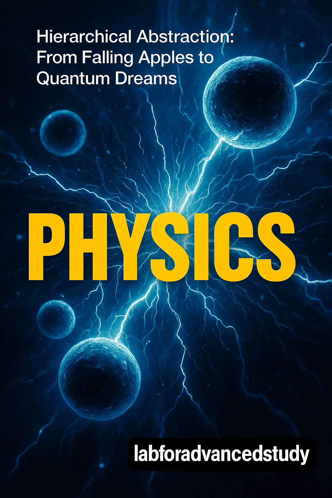

# Hierarchical Abstraction (HA) Series: The Universe Writing Its Own Manual

## What is HA?

Hierarchical Abstraction isn't just a way to organize knowledge - it's how reality itself is structured. From quantum foam to cosmic consciousness, everything exists in layers where each level emerges from and transcends the one below. This series maps that structure across every domain of human knowledge.

## The Universal Pattern: L0 → L9+

Every book follows the same 10-level ascent:
- **L0**: Raw, visceral experience (what you can touch/feel/see)
- **L1**: Basic elements and components  
- **L2**: How elements combine and interact
- **L3**: Complex systems and patterns
- **L4**: Integration and architecture
- **L5**: Historical patterns and evolution
- **L6**: Meta-level understanding
- **L7**: Human/consciousness dimensions
- **L8**: Information fields and deep structures
- **L9+**: Ultimate questions and cosmic purpose

## The Cosmic Timeline: From Big Bang to Omega Point

### 🌌 **Phase 1: The Universe Awakens** (13.8 Bya - 300 Kya)

The cosmos emerges from nothing, creates matter, stars, planets, and finally... us.

**Start Here:**
- [HA_physics](HA_physics/HA_Physics_Index.md) - From "things fall down" to quantum fields
- [HA_astronomy](HA_astronomy/HA_Astronomy_Index.md) - The sky we share to mysteries at the edge
- [HA_chemistry](HA_chemistry/HA_Chemistry_Index.md) - Sweet and sour to the edge of mystery

### 🧠 **Phase 2: Consciousness Emerges** (300 Kya - 10 Kya)

Matter becomes aware. The universe begins to know itself through human minds.

**Essential Reading:**
- [HA_consciousness](HA_consciousness/HA_Consciousness_Index.md) - Something it is like to you are the universe
- [HA_life](HA_life/HA_Life_Index.md) - Being alive to deep questions
- [HA_psychology](HA_psychology/HA_Psychology_Index.md) - Raw experience to the edge

### 🔥 **Phase 3: Tools and Symbols** (3.3 Mya - 5 Kya)

From stone tools to language, humans begin reshaping reality.

**Explore:**
- [HA_language](HA_language/HA_Language_Index.md) - Pointing ape to beyond symbol
- [HA_technology](HA_technology/HA_Technology_Index.md) - World we touch to reality as technology
- [HA_writing](HA_writing/HA_Writing_Index.md) - Before words to edge of language

### 🏛️ **Phase 4: Civilization Rises** (10 Kya - Present)

Humans organize into increasingly complex social structures.

**Deep Dive:**
- [HA_civilization](HA_civilization/HA_Civilization_Index.md) - Together we survive to edge of us
- [HA_society](HA_society/HA_Society_Index.md) - Personal space to the social mystery
- [HA_politics](HA_politics/HA_Politics_Index.md) - Street protest to why politics
- [HA_economy](HA_economy/HA_Economy_Index.md) - Visceral economy to ultimate questions
- [HA_money](HA_money/HA_Money_Index.md) - Physical money to ultimate questions

### 💭 **Phase 5: Abstract Thought** (2.5 Kya - Present)

Philosophy, mathematics, and science emerge as humanity's tools for understanding.

**Foundation:**
- [HA_philosophy](HA_philosophy/HA_Philosophy_Index.md) - Why does it hurt to omega point
- [HA_math](HA_math/HA_Math_Index.md) - Counting stones to the edge
- [HA_algorithms](HA_algorithms/HA_Algorithms_Index.md) - Everyday algorithms to limits of computation

### 🏢 **Phase 6: Organized Complexity** (Industrial Age - Present)

Human organization reaches new scales of complexity.

**Modern Systems:**
- [HA_company](HA_company/HA_Company_Index.md) - Human hive to beyond knowing
- [HA_art](HA_art/HA_Art_Index.md) - Visceral encounter to art futures
- [HA_religion](HA_religion/HA_Religion_Index.md) - Visceral sacred to ultimate questions
- [HA_ideology](HA_ideology/HA_Ideology_Index.md) - Visceral ideology to ultimate mystery

### 💻 **Phase 7: Digital Revolution** (1950 - Present)

Information becomes the new substrate of reality.

**Digital Age:**
- [HA_computer](HA_computer/HA_Computer_Index.md) - Clicking and glowing to limits and transcendence
- [HA_software_engineering](HA_software_engineering/HA_Software_Engineering_Index.md) - Direct experience to digital philosophy
- [HA_programming_language](HA_programming_language/HA_Programming_Language_Index.md) - Symbols that point to the conscious symbol
- [HA_internet](HA_internet/HA_Internet_Index.md) - Visceral web to ultimate questions
- [HA_AI](HA_AI/HA_AI_Index.md) - Magic in your pocket to edge of mystery

### 🚀 **Phase 8: Cosmic Expansion** (2030 - 10,000 CE)

Humanity spreads across the solar system and beyond.

**Future Horizons:**
- [HA_solar_system](HA_solar_system/HA_Solar_System_Index.md) - What you already know to edge of mystery
- [HA_space_engineering](HA_space_engineering/HA_Space_Engineering_Index.md) - Launch experience to cosmic purpose
- [HA_interstellar_civilization](HA_interstellar_civilization/HA_Interstellar_Civilization_Index.md) - Looking up to ultimate purpose

### ∞ **Phase 9: Ultimate Convergence** (10,000 CE - Omega Point)

All knowledge converges. The universe completes its self-understanding.

**The Synthesis:**
- [HA](HA/HA_Index.md) - The core book: You do not exist to synthesis
- [HA_HA](HA_HA/HA_HA_Index.md) - Meta-hierarchical abstraction itself

## Special Features

### 🔗 Cross-Domain Connections
Each book contains `/zettel/` directories with atomic insights that link across domains. Track how the same patterns appear in physics, consciousness, economics, and art.

### 📚 Multiple Perspectives
- **Korean translations** available for key books (physics, HA core)
- **Teaching guides** for educators
- **Practice guides** for implementation

### 🧩 The Meta Layer
The series is self-referential: organizing knowledge hierarchically IS an example of hierarchical abstraction. The map is the territory.

## How to Read This Series

1. **Start with your interest**: Pick any domain that fascinates you
2. **Read L0-L2** to ground yourself in direct experience
3. **Jump to L7-L9** to see the cosmic perspective
4. **Fill in L3-L6** to understand the bridge
5. **Explore zettel connections** across domains
6. **Return to [HA](HA/HA_Index.md)** to see how it all connects

## Remember

"You don't exist" - but that's exactly why you can understand everything. Individual identity is just a temporary pattern at one level of abstraction. From a higher dimension, you're the universe understanding itself.

Welcome to the operating manual of reality. The universe has been waiting for you to read it.

---

*"It's turtles all the way down, but also all the way up, and the turtles are made of pure information having a really weird dream about being turtles."* - From L9 somewhere

---

## 📚 Complete Book Navigation

### Core Books
- 🧬 **[HA](HA/HA_Index.md)** - 계층적 추상화: 당신은 존재하지 않는다 → 종합  
- 🔄 **[HA_HA](HA_HA/HA_HA_Index.md)** - 메타 계층적 추상화 그 자체

### Science & Technology
- 🤖 **[HA_AI](HA_AI/HA_AI_Index.md)** - AI: 주머니 속 마법 → 신비의 가장자리  
- 🔢 **[HA_algorithms](HA_algorithms/HA_Algorithms_Index.md)** - 알고리즘: 일상의 알고리즘 → 계산의 한계  
- 🌌 **[HA_astronomy](HA_astronomy/HA_Astronomy_Index.md)** - 천문학: 우리가 공유하는 하늘 → 신비의 가장자리  
- ⚗️ **[HA_chemistry](HA_chemistry/HA_Chemistry_Index.md)** - 화학: 달콤함과 신맛 → 신비의 가장자리  
- 💻 **[HA_computer](HA_computer/HA_Computer_Index.md)** - 컴퓨터: 클릭과 빛남 → 한계와 초월  
- ⚛️ **[HA_physics](HA_physics/HA_Physics_Index.md)** - 물리학: 물건이 떨어진다 → 가장자리  
- 💾 **[HA_programming_language](HA_programming_language/HA_Programming_Language_Index.md)** - 프로그래밍 언어: 가리키는 상징 → 의식적 상징  
- 🛠️ **[HA_software_engineering](HA_software_engineering/HA_Software_Engineering_Index.md)** - 소프트웨어 공학: 직접적 경험 → 디지털 철학  
- 🪐 **[HA_solar_system](HA_solar_system/HA_Solar_System_Index.md)** - 태양계: 당신이 이미 아는 것 → 신비의 가장자리  
- 🚀 **[HA_space_engineering](HA_space_engineering/HA_Space_Engineering_Index.md)** - 우주 공학: 발사 경험 → 우주적 목적  
- 🔧 **[HA_technology](HA_technology/HA_Technology_Index.md)** - 기술: 우리가 만지는 세계 → 질문들의 가장자리

### Life & Consciousness
- 🧠 **[HA_consciousness](HA_consciousness/HA_Consciousness_Index.md)** - 의식: 그것이 무엇 같은가 → 당신은 우주다  
- 🌱 **[HA_life](HA_life/HA_Life_Index.md)** - 생명: 살아있음 → 깊은 질문들  
- 💭 **[HA_psychology](HA_psychology/HA_Psychology_Index.md)** - 심리학: 날것의 경험 → 가장자리

### Society & Culture
- 🎨 **[HA_art](HA_art/HA_Art_Index.md)** - 예술: 내장적 만남 → 예술의 미래  
- 💹 **[HA_capitalism](HA_capitalism/HA_Capitalism_Index.md)** - 자본주의: 내장적 자본주의 → 궁극의 질문들  
- 🎬 **[HA_cinema](HA_cinema/HA_Cinema_Index.md)** - 영화: 생명의 깜빡임 → 왜 빛인가  
- 🏛️ **[HA_civilization](HA_civilization/HA_Civilization_Index.md)** - 문명: 함께 우리는 살아남는다 → 우리의 가장자리  
- 🏢 **[HA_company](HA_company/HA_Company_Index.md)** - 회사: 인간 벌집 → 알기를 넘어서  
- 📊 **[HA_economy](HA_economy/HA_Economy_Index.md)** - 경제: 내장적 경제 → 궁극의 질문들  
- 👑 **[HA_empire](HA_empire/HA_Empire_Index.md)** - 제국과 제국주의  
- 💰 **[HA_money](HA_money/HA_Money_Index.md)** - 돈: 물리적 화폐 → 궁극의 질문들  
- 🗳️ **[HA_politics](HA_politics/HA_Politics_Index.md)** - 정치: 거리 시위 → 왜 정치인가  
- 🙏 **[HA_religion](HA_religion/HA_Religion_Index.md)** - 종교: 내장적 신성 → 궁극의 질문들  
- 👥 **[HA_society](HA_society/HA_Society_Index.md)** - 사회: 개인 공간 → 사회적 신비

### Language & Communication
- 💬 **[HA_language](HA_language/HA_Language_Index.md)** - 언어: 가리키는 원숭이 → 상징을 넘어서  
- ✍️ **[HA_writing](HA_writing/HA_Writing_Index.md)** - 글쓰기: 말 이전 → 언어의 가장자리  
- 📚 **[HA_fiction](HA_fiction/HA_Fiction_Index.md)** - 소설: 첫 번째 거짓말 → 왜 이야기인가

### Ideas & Patterns
- 🌀 **[HA_ideology](HA_ideology/HA_Ideology_Index.md)** - 이데올로기: 내장적 이데올로기 → 궁극의 신비  
- 🔷 **[HA_pattern](HA_pattern/HA_Pattern_Index.md)** - 패턴: 패턴을 느끼다 → 패턴이다  
- 🤔 **[HA_philosophy](HA_philosophy/HA_Philosophy_Index.md)** - 철학: 왜 아픈가 → 오메가 포인트  
- 🔢 **[HA_math](HA_math/HA_Math_Index.md)** - 수학: 돌을 세기 → 가장자리

### Digital & Future
- 🌐 **[HA_internet](HA_internet/HA_Internet_Index.md)** - 인터넷: 내장적 웹 → 궁극의 질문들  
- 🎮 **[HA_game](HA_game/index.md)** - 게임: 첫 게임들 → 왜 우리는 놀까  
- 🎯 **[HA_video_game](HA_video_game/HA_Video_Game_Index.md)** - 비디오 게임: 상호작용의 원자 → 수렴  
- 🥽 **[HA_vr](HA_vr/HA_VR_Index.md)** - 가상현실: 경이로움 → VR과 인간 진화  
- 🌟 **[HA_interstellar_civilization](HA_interstellar_civilization/HA_Interstellar_Civilization_Index.md)** - 성간 문명: 위를 올려다보며 → 궁극의 목적

---

## Meta-Framework Documents

Beyond the individual books, several documents provide overarching perspectives on the HA project:

### 🗺️ **Navigation & Overview**
- [HA_master_index.md](HA_master_index.md) - The complete guide and navigation hub
- [1_map_universe.md](1_map_universe.md) - Timeline: human consciousness from 300Kya to present
- [2_map_tech.md](2_map_tech.md) - Timeline: detailed technology evolution  
- [3_map_future_sf.md](3_map_future_sf.md) - Timeline: future from 2030 to Omega Point

### 🌟 **Core Philosophy**
- [HA_Manifesto.md](HA_Manifesto.md) - Education as consciousness evolution
- [HA_is_everything.ko.md](HA_is_everything.ko.md) - HA는 모든 것이다 (Korean)

### 🔗 **Synthesis & Connections**
- [HA_Meta_Synthesis.md](HA_Meta_Synthesis.md) - The three pillars of human meaning
- [HA_connections.md](HA_connections.md) - Cross-domain connections and patterns
- [HA_Recursive_Nature.md](HA_Recursive_Nature.md) - HA understanding itself

### ✍️ **Writing & Practice**
- [HA_Writing_Is_Everything.md](HA_Writing_Is_Everything.md) - Writing as the universe documenting itself
- [HA_Writing_Meta_Synthesis.md](HA_Writing_Meta_Synthesis.md) - How writing creates reality
- [HA_Writing_Practice_Guide.md](HA_Writing_Practice_Guide.md) - Practical guide for HA writing

### 📚 **For Educators**
- [HA_Teaching_Guide.md](HA_Teaching_Guide.md) - How to teach using HA principles

These meta-documents reveal that HA isn't just a way to organize knowledge - it's a recognition that:
- Reality organizes itself hierarchically
- Education should align with consciousness evolution
- All human meaning-making follows the same patterns
- Writing itself is a form of the universe understanding itself
- The framework can transform how we learn, teach, and understand